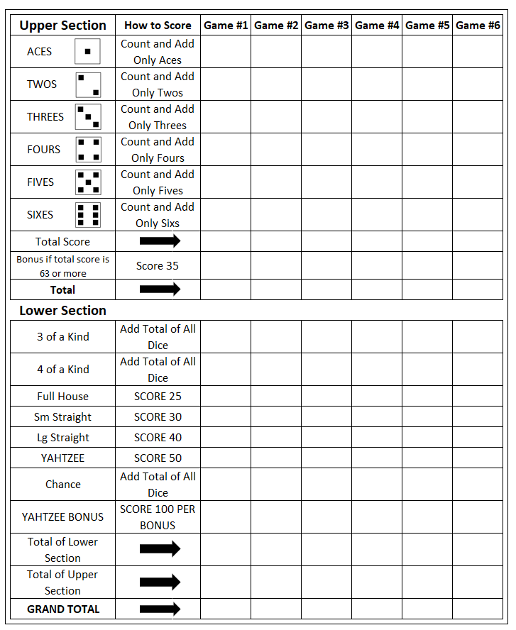

# How to Play Yahtzee
Roll dice for scoring combinations, and get the highest total score.

## Game Summary
On each turn, roll the dice up to 3 times to get the highest scoring combination for one of 13 categories. After you finish rolling, you must place a score or a zero in one of the 13 category boxes on your score card. The game ends when all players have filled in their 13 boxes. Scores are totaled, including any bonus points. The player with the highest total wins.
How to Play Each player takes a score card. To decide who goes first, each player in turn rolls all 5 dice. The player with the highest total goes first. Play then passes to the left.

## Taking A Turn
On your turn, you may roll the dice up to 3 times, although you may stop and score after your first or second roll. 

### First roll: 
Roll all 5 dice. Set any “keepers” aside. You may stop and score now, or roll again.

### Second roll: 
Reroll **ANY** or **ALL** dice you want. You don’t need to
declare which combination you’re rolling for; you may change your mind after any roll. You may stop and score after your second roll, or set aside any “keepers” and roll a third time.

### Third and final roll: 
Reroll **ANY** or **ALL** dice you want. After your third roll, you must fill in a box on your score card with a score or a zero. After you fill in a box, your turn is over.

## Scoring
Scoresheet in the following image:

When you are finished rolling, decide which box to fill in on your score card. For each game, there is a column of 13 boxes. You must fill in a box on each turn; if you can’t (or don’t want to) enter a score, you must enter a zero. Fill in each box only once, in any order, depending on your best scoring option.

The score card is divided into an Upper Section and a Lower Section. Scoring combinations for each section are explained below. 

| Upper Section |  What to Score        | 
| --------------|-----------------------| 
| Aces (Ones}   | Total of Aces only    | 
| Twos          | Total of Twos only    | 
| Threes        | Total of Threes only  | 
| Fours         | Total of Fours only   | 
| Fives         | Total of Fives only   | 
| Sixes         | Total of Sixes only   | 

To score in the Upper Section, add only the dice with the same number and enter the total in the appropriate box. For example, with the dice shown below you could score 9 in the Threes box, 2 in the Twos box or 5 in the Five box.
> # ⚂ ⚂ ⚂ ⚁ ⚄
Your goal in the Upper Section is to score a total of at least 63 points, to earn a 35-point bonus. The bonus points are based on scoring three of each number (Aces through Sixes); however, you may earn the bonus with any combination of scores totaling 63 points or more. 

Each of the Lower Section scoring combinations is explained as follows. 
| Lower Section         | What to Score         | 
|-----------------------|-----------------------| 
| 3 of a Kind           | Total of all 5 dice   | 
| 4 ofa Kind            | Total of all 5 dice   | 
| Full House            | 25 points             | 
| Small Straight        | 30 points             | 
| Large Straight        | 40 points             | 
| YAHTZEE (5 ofa Kind)  | 50 points             | 
| Chance                | Total of all 5 dice   | 

### 3 of a Kind: 
Score in this box only if the dice include 3 or more of the same number. For example, with the dice shown below you could score 18 points in the 3 of a Kind box.
> # ⚄ ⚄ ⚄ ⚁ ⚀
_Other Scoring Options_: You could instead score 18 in the Chance box, or you could score in the Upper Section: 15 in the Fives box, 2 in the Twos box or 1 in the Aces box.

### 4 of a Kind: 
Score in this box only if the dice include 4 or more of the same number. For example, with the dice shown below you could score 14 points in the 4 of a Kind box.
> # ⚁ ⚁ ⚁ ⚅ ⚁
_Other Sconhg Options:_ You could instead score 14 in the 3 of a Kind box or in the Chance box-or you could score in the Upper Section: 8 in the Twos box, or 6 in the Sixes box.

### Small Straight: 
Score in this box only if the dice show any sequence of four numbers. Any Small Straight is worth 30 points. You could score 30 points in the Small Straight box with any of the three dice combinations shown below.
> # ⚀ ⚁ ⚂ ⚃ *
> # ⚁ ⚂ ⚃ ⚄ *
> # ⚂ ⚃ ⚄ ⚅ *

### Full House: 
Score in this box only if the dice show three of one number and two of another. Any Full House is worth 25 points. For example, with the dice shown below you could score 25 points in the Full House box.
> # ⚁ ⚁ ⚁ ⚅ ⚅

Other Scoring Options: You could instead score in the Chance box, or in the appropriate Upper Section box.

> TODO fix below section
---
Large Straight: Score in
this box only if the dice
show any sequence offive
numbers. Any Large
Straight is worth 40 points.
You could score 40 points
in the Large Straight box
with either of the two dice
combinations shown below.
.
.
.
.
.
.
. •
. .
.
•
.
. .
. •
. •
.
. .
The first YAHTZEE you
enter in the YAHTZEE box
is worth 50 points. For each
additional YAHTZEE you
roll, you earn a bonus (see
YAHTZEE BONUS, below)!
Chance: Score the total of
any 5 dice in this box. This
catch-all category comes in
handy when you can't (or
don't want to) score in
another category, and don't
want to enter a zero.
1
Other Scoring Options: You
could instead score in the
Small Straight box, the
Chance box, or the appropriate Upper Section box.
For example, you could score
22 points in the Chance box
with the dice shown below.
.
i
. .
. .
. .
.
. .
. .
• .
. .
. .
. •
. .
YAHTZEE: Score in this
box only if the dice show
five of the same number
(5 of a kind). A YAHTZEE
example is shown below.
. . • . •
YAHTZEE BONUS: If
you roll a YAHTZEE and
have already filled in the
YAHTZEE box with a 50,
you get a 100-point bonus!
Take one bonus chip, then
5
place a check mark (J) in
the YAHTZEE BONUS box
on your score card. Then
fill in one of the 13 boxes on
your score card according to
the JOKER RULES,
described below.
As long as you've scored 50
in the YAHTZEE box, you
get a YAHTZEE bonus for
each additional YAHTZEE
you roll -just squeeze in the
check marks if necessaryl
If you roll a YAHTZEE and
have already entered zero in
the YAHTZEE box, you do
not am a YAHTZEE
bonus; however, you must
fill in one of the 13 boxes on
your score card according to
the JOKER RULES below.
]OKER RULES: Score the
total of all 5 dice in the
appropriate Upper Section
box. If this box has already
been filled in, score as
follows in any open Lower
Section box:
3 ofa Kind: Total of all 5 dice
A ofa Kind: Total of all 5 dice
Fu// House: 25 points
SmalI Straight: 30 points
Large Straight: 40 points
Chance: Total oFclll 5 dice
1
Ifthe appropriate Upper
Section box and all Lower
Section boxes are filled in,
you must enter a zero in any
open Upper Section box.
For example, you roll 5
Pours. You've already
entered zero in the
YAHTZEE box, and have
also scored in the Fours box
in the Upper Section. The
Joker rules allow you to
score in any open box in the
Lower Section. You decide
to score 40 points in the
Large Straight box.
6
ENDING A GAME
How to Win
Once each player has filled
in all 13 category boxes,
the game ends. Each player
now adds up his or her score
as follows:
Upper Section: Add up the
Upper Section scores and
enter the total in the
TOTAL SCORE box. Enter
the 35~point bonus in the
BONUS box ifyou scored
63 points or more. Then
enter the total in the
TOTAL box.
Lower Section: Add up the
Lower Section scores, and
enter the total in the
TOTAL ofLower Section
box. Add 100 points for
each check mark in the
YAHTZEE BONUS boxes
(that is, one check mark for
each bonus chip).
Grand Total: Add the
Upper Section and Lower
Section scores, and enter
the total in this box. This is
your score for the game.
After the scores are tallied,
the player with the highest
Grand Total wins the game!
SOLO PLAY
No competition around?
Challenge yourself in solitaire
play, and try to beat your pre;
vious scores!

---